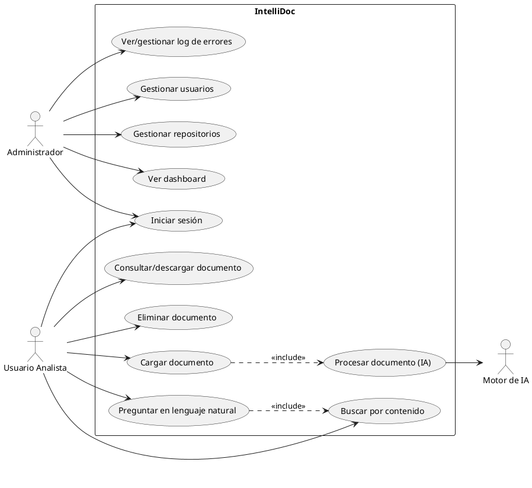

# 01 – Documento de Análisis
## Proyecto: IntelliDoc – Sistema Inteligente de Gestión y Análisis Documental

**Curso:** Desarrollo de Aplicaciones Empresariales – VI semestre
**Docente:** Wilson Castaño Galviz
**Institución:** Unidades Tecnológicas de Santander (UTS)
**Versión:** 1.0

---

## 1. Descripción del problema y contexto empresarial

Muchas empresas almacenan su información en carpetas de archivos (PDF, Word, TXT, imágenes escaneadas) sin ningún tipo de organización inteligente. Esto genera un "almacenamiento pasivo": los documentos existen, pero nadie puede consultarlos de forma ágil, clasificarlos automáticamente ni extraer información útil de ellos sin abrirlos uno por uno.

El caso de estudio de este proyecto es una empresa (en adelante, "la Organización") que recibe y produce constantemente documentos de distinta naturaleza —contratos, facturas, informes técnicos, actas, hojas de vida, políticas internas, entre otros— y que actualmente no cuenta con ningún mecanismo para:

- Saber qué contiene cada documento sin abrirlo.
- Encontrar documentos relevantes a partir de una pregunta en lenguaje natural.
- Obtener resúmenes o datos clave sin leer el documento completo.
- Tener visibilidad global (indicadores) de su repositorio documental.

Este problema genera pérdida de tiempo operativo, dificultad para auditar información y riesgo de que decisiones importantes se tomen sin conocer datos que ya existen en la organización, simplemente porque están "enterrados" en un archivo.

## 2. Identificación de la necesidad y oportunidad de negocio

**Necesidad:** convertir un repositorio de archivos pasivo en un repositorio inteligente, consultable en lenguaje natural, que reduzca el tiempo de búsqueda y análisis documental.

**Oportunidad de negocio:**
- Reducir el tiempo que el personal administrativo invierte revisando documentos manualmente.
- Permitir que cualquier usuario autorizado obtenga respuestas confiables sobre el contenido documental sin depender de quien "conoce" los archivos.
- Sentar la base tecnológica (IA + repositorio documental) que puede escalar a otros procesos de la organización (auditoría, cumplimiento, atención al cliente).

## 3. Objetivo general

Diseñar, desarrollar, probar, documentar e implementar una aplicación web que gestione documentos empresariales y aplique Inteligencia Artificial para clasificar, resumir, extraer información y responder preguntas en lenguaje natural sobre dicho contenido.

## 4. Objetivos específicos

1. Implementar un módulo de autenticación y control de usuarios con al menos dos roles.
2. Implementar la gestión de repositorios/carpetas y el ciclo de vida de los archivos (carga, consulta, descarga, eliminación).
3. Implementar un pipeline de procesamiento documental: extracción de texto → IA → almacenamiento de resultados.
4. Implementar clasificación automática de documentos en un mínimo de tres categorías de negocio.
5. Implementar generación automática de resúmenes por documento.
6. Implementar extracción estructurada de información relevante para al menos tres tipos de documentos.
7. Implementar búsqueda semántica y consulta en lenguaje natural sobre el contenido documental (enfoque RAG).
8. Implementar un dashboard con indicadores del estado del repositorio.
9. Documentar todo el ciclo de ingeniería de software del proyecto (análisis, diseño, desarrollo, pruebas, implementación).

## 5. Alcance y exclusiones

### 5.1 Incluido en el alcance
- Autenticación básica (usuario/contraseña) con roles Administrador y Usuario.
- CRUD de repositorios (carpetas lógicas) y archivos.
- Soporte de formatos: PDF, DOCX y TXT.
- Procesamiento IA: extracción de texto, clasificación, resumen, extracción de campos clave, embeddings y búsqueda semántica.
- Consulta en lenguaje natural (chat) sobre uno o varios documentos, con respuesta basada en el contenido real (RAG).
- Dashboard con indicadores (documentos totales, por categoría, por estado de procesamiento, errores).
- Registro (log) de errores y estados de procesamiento de cada documento.
- Repositorio objetivo de mínimo 30 documentos de prueba, sin datos personales reales. En el estado actual del workspace la lista y el procedimiento existen, pero los archivos físicos aún están pendientes.

### 5.2 Exclusiones (fuera de alcance)
- Procesamiento de formatos distintos a PDF, DOCX y TXT (ej. hojas de cálculo, imágenes puras, audio/video) en esta versión.
- OCR avanzado para documentos escaneados de baja calidad (se documenta como trabajo futuro si el tiempo lo permite).
- Integraciones con sistemas externos de la empresa (ERP, CRM, correo corporativo).
- Firma electrónica, flujos de aprobación o versionado avanzado de documentos.
- Aplicaciones móviles nativas (el proyecto es web, responsivo).
- Multi-tenant real para múltiples empresas (se maneja una sola organización).

## 6. Identificación de actores y usuarios

| Actor | Tipo | Descripción |
|---|---|---|
| Administrador | Humano (interno) | Gestiona usuarios, repositorios y tiene visión completa del dashboard y logs. |
| Usuario Analista | Humano (interno) | Carga y consulta documentos, realiza búsquedas y preguntas en lenguaje natural. |
| Motor de IA | Sistema (actor de apoyo) | Servicio/API que ejecuta clasificación, resumen, extracción y generación de respuestas. |
| Sistema de Almacenamiento | Sistema (actor de apoyo) | Base de datos y almacenamiento de archivos/embeddings. |

## 7. Perfil de usuarios / personas

**Persona 1 – Andrea, Administradora de Operaciones (Administrador)**
- 35 años, responsable de la gestión documental de la empresa.
- Necesita saber cuántos documentos hay, de qué tipo y si hay errores de procesamiento.
- Poca paciencia para interfaces complejas; valora la claridad de los indicadores.

**Persona 2 – Camilo, Analista Administrativo (Usuario)**
- 26 años, revisa contratos y facturas a diario.
- Necesita encontrar información puntual ("¿cuál es el valor del contrato con el proveedor X?") sin leer documentos completos.
- Usa el sistema desde el navegador, en horario laboral.

## 8. Requerimientos funcionales (numerados y verificables)

| ID | Requerimiento | Criterio de verificación |
|---|---|---|
| RF-01 | El sistema debe permitir el registro/autenticación de usuarios mediante usuario y contraseña. | Un usuario no autenticado no puede acceder a ninguna funcionalidad protegida. |
| RF-02 | El sistema debe distinguir al menos dos roles: Administrador y Usuario. | Las opciones de administración de usuarios solo son visibles/accesibles para el rol Administrador. |
| RF-03 | El sistema debe permitir crear, listar, renombrar y eliminar repositorios (carpetas lógicas). | Un repositorio creado aparece listado y puede eliminarse. |
| RF-04 | El sistema debe permitir cargar archivos en formato PDF, DOCX y TXT dentro de un repositorio. | Un archivo cargado queda visible en el repositorio correspondiente. |
| RF-05 | El sistema debe permitir consultar, descargar y eliminar archivos cargados. | Cada acción sobre un archivo produce el resultado esperado y se refleja en la interfaz. |
| RF-06 | El sistema debe extraer automáticamente el texto de cada archivo cargado. | Tras la carga, el documento cuenta con contenido textual asociado en la base de datos. |
| RF-07 | El sistema debe clasificar automáticamente cada documento en una de al menos tres categorías definidas. | Todo documento procesado exitosamente tiene una categoría asignada. |
| RF-08 | El sistema debe generar un resumen automático por documento. | Todo documento procesado exitosamente cuenta con un resumen visible en su detalle. |
| RF-09 | El sistema debe extraer información estructurada relevante para al menos tres tipos de documento (ej. fecha, partes, montos). | Los campos extraídos se muestran en el detalle del documento. |
| RF-10 | El sistema debe permitir búsqueda de documentos por palabra clave sobre su contenido. | Una búsqueda por término presente en un documento lo retorna en los resultados. |
| RF-11 | El sistema debe permitir realizar preguntas en lenguaje natural sobre el contenido documental y recibir una respuesta basada en dicho contenido (RAG). | La respuesta entregada cita o referencia el/los documento(s) fuente. |
| RF-12 | El sistema debe mostrar un dashboard con indicadores: total de documentos, documentos por categoría, documentos por estado de procesamiento y errores recientes. | El dashboard refleja los datos reales del repositorio al momento de la consulta. |
| RF-13 | El sistema debe registrar el estado de procesamiento de cada documento (pendiente, procesando, procesado, error). | El estado es consultable desde la interfaz para cada documento. |
| RF-14 | El sistema debe registrar los errores ocurridos durante el procesamiento IA, incluyendo causa y documento asociado. | Cada error queda visible en un log accesible por el Administrador. |

## 9. Requerimientos no funcionales

| ID | Requerimiento |
|---|---|
| RNF-01 | La interfaz debe ser web, responsiva y utilizable desde navegadores modernos (Chrome, Edge, Firefox). |
| RNF-02 | Las contraseñas deben almacenarse cifradas (hash), nunca en texto plano. |
| RNF-03 | Las credenciales y llaves de API (API Keys) deben gestionarse mediante variables de entorno, nunca hardcodeadas ni publicadas en el repositorio Git. |
| RNF-04 | El sistema debe registrar (log) los errores de forma centralizada para facilitar el diagnóstico. |
| RNF-05 | El procesamiento IA de un documento de tamaño típico (≤10 páginas) no debe superar un tiempo razonable de espera percibida (se documentará el tiempo real medido en Pruebas). |
| RNF-06 | El código debe seguir una arquitectura por capas (presentación, lógica de negocio, acceso a datos) para facilitar mantenimiento. |
| RNF-07 | El sistema debe ser desplegable de forma reproducible (scripts/documentación de instalación). |
| RNF-08 | El sistema debe validar el tipo y tamaño de archivo antes de aceptar una carga. |

## 10. Reglas de negocio

- RN-01: Solo se aceptan archivos en formato PDF, DOCX o TXT; cualquier otro formato es rechazado con mensaje explícito.
- RN-02: Todo documento cargado debe pasar por el pipeline de procesamiento IA antes de considerarse "disponible" para búsqueda o preguntas.
- RN-03: Un documento en estado "error" puede reprocesarse manualmente por un Administrador.
- RN-04: Solo el rol Administrador puede eliminar usuarios o repositorios completos; un Usuario solo puede eliminar los archivos que él mismo cargó.
- RN-05: La categoría asignada por la IA puede ser corregida manualmente por un Administrador; el cambio queda registrado.
- RN-06: Toda respuesta generada por el módulo de preguntas en lenguaje natural debe indicar de qué documento(s) proviene la información.

## 11. Historias de usuario (con criterios de aceptación)

**HU-01 – Cargar un documento**
Como Usuario Analista, quiero cargar un archivo PDF/DOCX/TXT a un repositorio, para que el sistema lo procese y quede disponible para consulta.
*Criterios de aceptación:*
- Dado un archivo válido, cuando lo cargo, entonces aparece en el repositorio con estado "pendiente" y luego cambia a "procesado" o "error".
- Dado un archivo de formato no soportado, cuando intento cargarlo, entonces el sistema lo rechaza con un mensaje claro.

**HU-02 – Consultar el resumen de un documento**
Como Usuario Analista, quiero ver el resumen automático de un documento, para no tener que leerlo completo.
*Criterios de aceptación:*
- Dado un documento en estado "procesado", cuando abro su detalle, entonces veo un resumen generado por IA.

**HU-03 – Buscar documentos por contenido**
Como Usuario Analista, quiero buscar documentos usando palabras clave, para encontrar información rápidamente.
*Criterios de aceptación:*
- Dado un término presente en el contenido de un documento, cuando lo busco, entonces ese documento aparece en los resultados.

**HU-04 – Preguntar en lenguaje natural**
Como Usuario Analista, quiero hacer una pregunta en lenguaje natural sobre mis documentos, para obtener una respuesta directa sin buscar manualmente.
*Criterios de aceptación:*
- Dado que existen documentos procesados relacionados con mi pregunta, cuando la formulo, entonces recibo una respuesta que cita el/los documento(s) fuente.
- Dado que no existe información relacionada, cuando pregunto, entonces el sistema indica que no encontró información suficiente (no inventa datos).

**HU-05 – Ver el dashboard**
Como Administrador, quiero ver un dashboard con indicadores del repositorio, para tener visibilidad del estado general.
*Criterios de aceptación:*
- Dado que existen documentos cargados, cuando entro al dashboard, entonces veo el total de documentos, su distribución por categoría y por estado.

**HU-06 – Gestionar usuarios**
Como Administrador, quiero crear y desactivar usuarios, para controlar quién accede al sistema.
*Criterios de aceptación:*
- Dado un nuevo usuario, cuando lo creo con rol Usuario, entonces puede iniciar sesión con las credenciales asignadas.

**HU-07 – Revisar errores de procesamiento**
Como Administrador, quiero ver un registro de errores de procesamiento IA, para poder corregir o reprocesar documentos.
*Criterios de aceptación:*
- Dado un documento que falló al procesarse, cuando reviso el log, entonces veo la causa del error y puedo reintentar el procesamiento.

## 12. Casos de uso

### 12.1 Diagrama de casos de uso (descripción textual / PlantUML)

### 12.2 Especificación de casos de uso principales

**CU-04: Cargar documento**
- **Actor principal:** Usuario Analista.
- **Precondición:** el usuario está autenticado y tiene un repositorio destino.
- **Flujo principal:**
  1. El usuario selecciona un repositorio y un archivo local.
  2. El sistema valida formato y tamaño.
  3. El sistema almacena el archivo y crea el registro con estado "pendiente".
  4. El sistema encola el documento para el pipeline de procesamiento IA (CU-07).
  5. El sistema notifica éxito al usuario.
- **Flujos alternativos:** formato inválido (paso 2) → el sistema rechaza y muestra el error.
- **Postcondición:** el documento existe en el repositorio con un estado de procesamiento asociado.

**CU-07: Procesar documento (IA)**
- **Actor principal:** Sistema (disparado por CU-04); **Actor de apoyo:** Motor de IA.
- **Precondición:** existe un documento en estado "pendiente".
- **Flujo principal:**
  1. El sistema extrae el texto del archivo (PDF/DOCX/TXT).
  2. El sistema divide el texto en fragmentos (chunking) y genera embeddings.
  3. El sistema almacena los embeddings en la base de datos vectorial.
  4. El sistema solicita al modelo de IA: clasificación, resumen y extracción de campos clave.
  5. El sistema almacena los resultados y actualiza el estado a "procesado".
- **Flujo alternativo:** si falla la extracción o la llamada a IA, el sistema registra el error y marca el documento como "error" (RN-03).
- **Postcondición:** el documento tiene categoría, resumen, campos extraídos y está disponible para búsqueda/preguntas.

**CU-09: Preguntar en lenguaje natural**
- **Actor principal:** Usuario Analista; **Actor de apoyo:** Motor de IA.
- **Precondición:** existen documentos en estado "procesado".
- **Flujo principal:**
  1. El usuario escribe una pregunta en lenguaje natural.
  2. El sistema genera el embedding de la pregunta.
  3. El sistema recupera los fragmentos más similares desde la base vectorial (búsqueda semántica).
  4. El sistema envía la pregunta + fragmentos recuperados al modelo de IA (RAG).
  5. El sistema muestra la respuesta junto con los documentos fuente.
- **Flujo alternativo:** si no hay fragmentos suficientemente relevantes, el sistema responde que no encontró información suficiente (RN-06).
- **Postcondición:** el usuario recibe una respuesta trazable a documentos reales.

## 13. Priorización de requisitos (MoSCoW)

| Prioridad | Requisitos |
|---|---|
| Must have | RF-01, RF-02, RF-03, RF-04, RF-05, RF-06, RF-07, RF-08, RF-11, RF-13, RNF-02, RNF-03 |
| Should have | RF-09, RF-10, RF-12, RF-14, RNF-04, RNF-08 |
| Could have | RN-05 (corrección manual de categoría), reprocesamiento automático con reintentos |
| Won't have (esta versión) | OCR avanzado, integraciones externas, multi-tenant |

## 14. Matriz de trazabilidad inicial (objetivo ↔ requisito)

| Objetivo específico | Requisitos relacionados |
|---|---|
| OE-1 Autenticación y roles | RF-01, RF-02, RNF-02, RNF-03 |
| OE-2 Gestión de repositorios/archivos | RF-03, RF-04, RF-05, RNF-08 |
| OE-3 Pipeline de procesamiento IA | RF-06, RF-13, RF-14, RNF-04, RNF-05 |
| OE-4 Clasificación | RF-07 |
| OE-5 Resumen | RF-08 |
| OE-6 Extracción de información | RF-09 |
| OE-7 Búsqueda y RAG | RF-10, RF-11 |
| OE-8 Dashboard | RF-12 |
| OE-9 Documentación del ciclo completo | Todos (transversal) |

*(Esta matriz se ampliará en el documento 08 – Matriz de Trazabilidad, incorporando diseño, código y pruebas.)*

## 15. Análisis de riesgos del proyecto

| Riesgo | Probabilidad | Impacto | Mitigación |
|---|---|---|---|
| Costos o límites de la API de IA (LLM) usada | Media | Alto | Usar un modelo económico o con capa gratuita; permitir configurar un proveedor alternativo; limitar el tamaño de contexto enviado. |
| Calidad insuficiente de la extracción de texto en PDFs escaneados | Media | Medio | Excluir OCR avanzado del alcance; documentar la limitación; probar con PDFs con texto real (no escaneados) para el repositorio de pruebas. |
| Respuestas incorrectas o "alucinadas" del modelo de IA en el módulo de preguntas | Media | Alto | Aplicar RAG estricto (solo responder con base en fragmentos recuperados) y mostrar siempre la fuente; si no hay evidencia suficiente, responder que no se encontró información. |
| Retrasos por curva de aprendizaje en embeddings/bases vectoriales | Media | Medio | Empezar con una librería sencilla de vector store local (ej. Chroma) antes de considerar soluciones más complejas. |
| Fuga accidental de credenciales/API Keys en el repositorio Git | Baja | Alto | Uso de archivo `.env` + `.gitignore`; revisión antes de cada commit. |
| Todos los integrantes no dominan todas las partes del proyecto (riesgo de sustentación) | Media | Alto | Repartir el trabajo por capas, pero documentar y hacer una revisión cruzada de todo el equipo antes de la sustentación. |

---

*Este documento corresponde a la fase I – Análisis del ciclo de desarrollo del proyecto IntelliDoc y será la base para el Documento de Diseño (02).*
