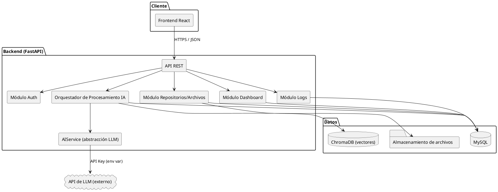
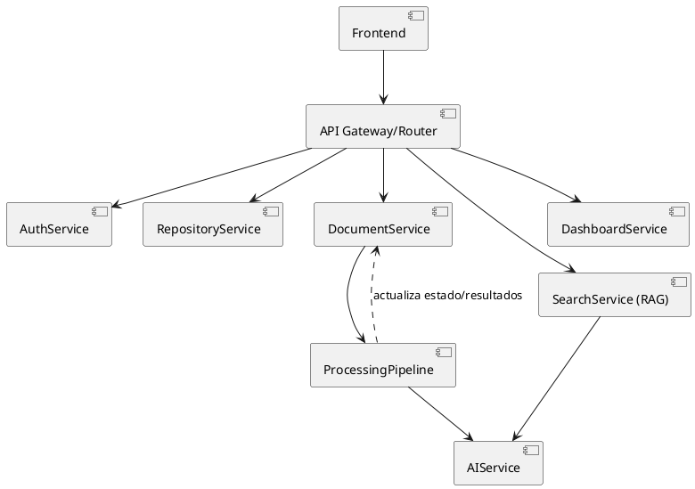
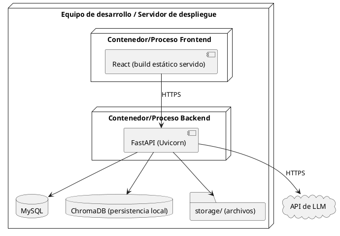
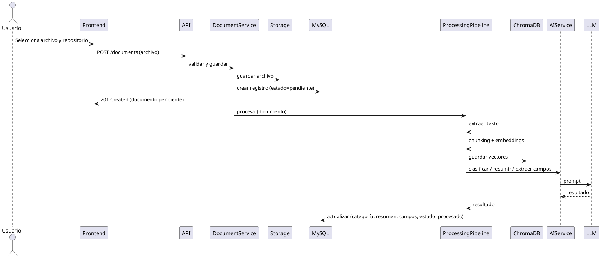
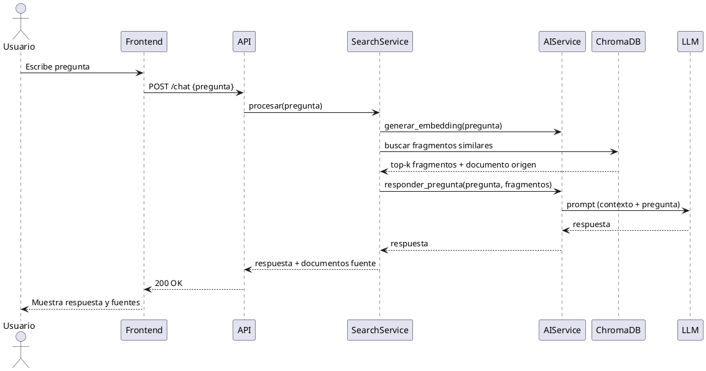
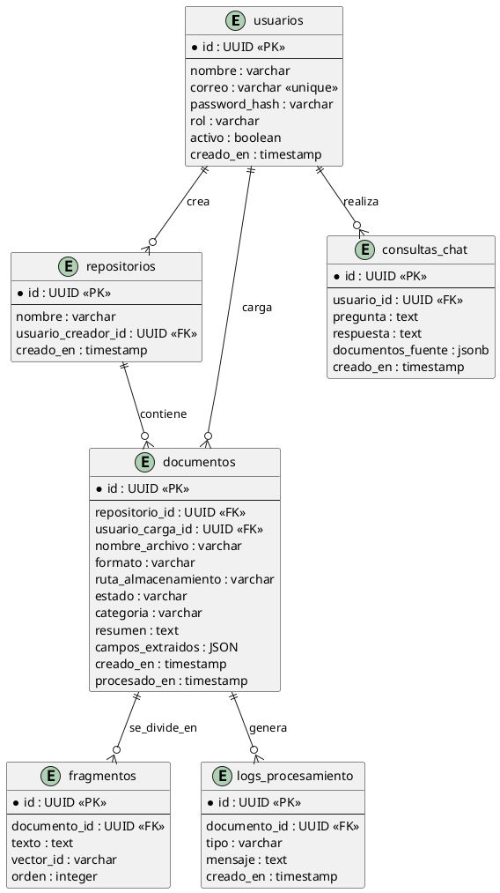

# 02 – Documento de Diseño
## Proyecto: IntelliDoc – Sistema Inteligente de Gestión y Análisis Documental

**Curso:** Desarrollo de Aplicaciones Empresariales – VI semestre
**Docente:** Wilson Castaño Galviz
**Versión:** 1.0

---

## 1. Decisiones tecnológicas y su justificación

| Capa | Tecnología elegida | Justificación |
|---|---|---|
| Frontend | React + Tailwind CSS | Componentes reutilizables para repositorios, chat de preguntas y dashboard; curva de aprendizaje ya conocida por el equipo. |
| Backend | Python + FastAPI | Python tiene el ecosistema más maduro para IA/NLP (extracción de texto, embeddings, LLMs); FastAPI permite construir APIs REST rápidas, con documentación automática (OpenAPI/Swagger), ideal para exponer el pipeline de IA. |
| Base de datos relacional | MySQL 8.0 | Robusta, gratuita y disponible en el entorno documentado; permite guardar JSON para los campos extraídos variables por tipo de documento. |
| Base de datos vectorial | ChromaDB embebida | Ligera y local. La implementación actual usa `EphemeralClient`, por lo que los vectores viven en memoria y deben regenerarse al reiniciar el backend. |
| Almacenamiento de archivos | Sistema de archivos local (carpeta `storage/`), referenciado desde la BD | Suficiente para el alcance académico; se documenta como reemplazable por almacenamiento en la nube (S3, etc.) en un entorno productivo real. |
| Extracción de texto | `pdfplumber` (PDF), `python-docx` (DOCX), lectura directa (TXT) | Librerías estándar, gratuitas, confiables para texto nativo (no escaneado). |
| Embeddings | `sentence-transformers` (modelo local, ej. `all-MiniLM-L6-v2`) | No depende de una API de pago; permite generar embeddings de forma reproducible y gratuita para el proyecto académico. |
| LLM (clasificación, resumen, extracción, respuesta RAG) | API de un proveedor de modelos de lenguaje (configurable vía variable de entorno, ej. Anthropic/OpenAI) | Se abstrae en una interfaz propia (`AIService`) para poder cambiar de proveedor sin afectar el resto del sistema; se justifica el uso de un LLM porque las tareas (resumir, clasificar con criterio, responder preguntas) requieren comprensión de lenguaje natural, no solo reglas fijas. |
| Autenticación | JWT (JSON Web Tokens) | Estándar para APIs REST sin estado; simple de implementar y de explicar en la sustentación. |
| Control de versiones | Git + repositorio remoto (GitHub) | Requisito explícito del entregable 09. |

## 2. Arquitectura general de la solución

IntelliDoc sigue una **arquitectura en capas** con un **pipeline de procesamiento asíncrono** para la parte de IA:

1. **Capa de presentación (Frontend – React):** interfaz de usuario (login, repositorios, carga de archivos, dashboard, chat de preguntas).
2. **Capa de API/Backend (FastAPI):** expone endpoints REST, aplica autenticación/autorización y reglas de negocio.
3. **Capa de procesamiento IA (pipeline):** orquesta extracción → chunking → embeddings → clasificación/resumen/extracción → almacenamiento de resultados.
4. **Capa de datos:** MySQL (datos estructurados) + ChromaDB efímero (vectores) + almacenamiento de archivos.
5. **Servicios externos:** API del modelo de lenguaje (LLM).

### 2.1 Diagrama de arquitectura (PlantUML)



### 2.2 Arquitectura por subsistema

- **Frontend:** SPA en React, consume la API REST vía `fetch`/`axios`, maneja el token JWT en memoria/almacenamiento seguro.
- **Backend:** FastAPI organizado en routers (`auth`, `repositories`, `documents`, `chat`, `dashboard`), capa de servicios (lógica de negocio) y capa de repositorios de datos (acceso a BD), siguiendo un patrón similar a MVC/Service-Repository.
- **Datos:** MySQL para entidades del negocio; ChromaDB efímero para los vectores de cada fragmento de documento (chunk).
- **IA:** un `AIService` con métodos `clasificar()`, `resumir()`, `extraer_campos()`, `responder_pregunta()`, que internamente arma el prompt y llama al LLM, aislando el resto del sistema del proveedor específico.

## 3. Diagrama de componentes



## 4. Diagrama de despliegue


*Nota: para el entorno académico se plantea un despliegue simple (una sola máquina/VM o entorno local), documentado en el punto 05 – Implementación y Despliegue.*

## 5. Diagramas de secuencia de procesos principales

### 5.1 Secuencia: Carga y procesamiento de un documento



### 5.2 Secuencia: Pregunta en lenguaje natural (RAG)



## 6. Modelo de datos (entidad-relación)



## 7. Diccionario de datos (resumen de tablas principales)

**Tabla `documentos`**

| Campo | Tipo | Descripción |
|---|---|---|
| id | UUID | Identificador único del documento. |
| repositorio_id | UUID | Repositorio al que pertenece. |
| usuario_carga_id | UUID | Usuario que cargó el archivo. |
| nombre_archivo | varchar | Nombre original del archivo. |
| formato | varchar | pdf / docx / txt. |
| ruta_almacenamiento | varchar | Ruta física/lógica del archivo. |
| estado | varchar | pendiente / procesando / procesado / error. |
| categoria | varchar | Categoría asignada por IA (ej. contrato, factura, informe). |
| resumen | text | Resumen generado por IA. |
| campos_extraidos | jsonb | Campos clave extraídos (varían según tipo de documento). |
| creado_en / procesado_en | timestamp | Trazabilidad temporal. |

*(El diccionario completo de todas las tablas se ampliará en el documento técnico, 03-Desarrollo, a medida que se implemente el modelo.)*

## 8. Diseño de API / servicios (endpoints principales)

| Método | Endpoint | Descripción | Rol requerido |
|---|---|---|---|
| POST | /auth/login | Autenticación, retorna JWT | Público |
| POST | /users | Crear usuario | Administrador |
| GET | /repositories | Listar repositorios | Usuario/Admin |
| POST | /repositories | Crear repositorio | Usuario/Admin |
| POST | /documents | Cargar documento (multipart) | Usuario/Admin |
| GET | /documents/{id} | Detalle de documento (resumen, categoría, campos) | Usuario/Admin |
| GET | /documents/{id}/download | Descargar archivo original | Usuario/Admin |
| DELETE | /documents/{id} | Eliminar documento | Dueño/Admin |
| GET | /documents/search?q= | Búsqueda por palabra clave | Usuario/Admin |
| POST | /chat | Pregunta en lenguaje natural (RAG) | Usuario/Admin |
| GET | /dashboard/summary | Indicadores del repositorio | Administrador |
| GET | /logs | Log de errores de procesamiento | Administrador |
| POST | /documents/{id}/reprocess | Reprocesar documento en error | Administrador |

## 9. Diseño de interfaces y prototipos (wireframes descriptivos)

- **Login:** formulario simple (correo/usuario + contraseña).
- **Panel principal:** menú lateral (Repositorios, Dashboard, Chat, Logs [solo admin], Usuarios [solo admin]).
- **Vista de repositorio:** lista de documentos con estado (badge de color: pendiente=gris, procesando=azul, procesado=verde, error=rojo), botón de carga.
- **Detalle de documento:** nombre, categoría, resumen, campos extraídos, botón de descarga.
- **Chat / Preguntas:** interfaz tipo chat; cada respuesta muestra "Fuentes: documento X, documento Y".
- **Dashboard:** tarjetas con total de documentos, gráfico de documentos por categoría, gráfico de documentos por estado, tabla de últimos errores.

*(Los mockups visuales de alta fidelidad se anexarán como imágenes/Figma en la carpeta 02-Diseno cuando estén disponibles.)*

## 10. Flujo de procesamiento documental (resumen)

```
Archivo cargado
   → Extracción de texto (pdfplumber / python-docx / lectura directa)
   → División en fragmentos (chunking, ~500 tokens con solapamiento)
   → Generación de embeddings (sentence-transformers)
  → Almacenamiento de vectores (ChromaDB efímero) + texto de fragmentos (MySQL)
   → Clasificación (LLM, prompt con categorías predefinidas)
   → Resumen (LLM)
   → Extracción de campos clave según tipo de documento (LLM + validación con expresiones regulares cuando aplica, ej. fechas y montos)
   → Actualización de estado a "procesado" (o "error" con log)
```

## 11. Diseño de la integración con IA (requisito central)

Se adopta un enfoque **RAG (Retrieval-Augmented Generation)** para el módulo de preguntas, y **LLM con prompting estructurado** para clasificación, resumen y extracción:

- **Por qué RAG y no solo un LLM "a secas":** un LLM sin contexto no conoce el contenido real de los documentos de la empresa y podría "alucinar" respuestas. RAG obliga al modelo a responder únicamente con base en los fragmentos recuperados, lo cual es verificable (se muestran las fuentes) y reduce el riesgo de información incorrecta — esto responde directamente a la regla de negocio RN-06.
- **Por qué embeddings locales (sentence-transformers) y no solo embeddings del proveedor del LLM:** evita costos adicionales y dependencia total de un único proveedor externo; el proyecto puede ejecutarse con embeddings 100% locales aunque el LLM final sí use una API externa.
- **Limitación actual del almacén vectorial:** la implementación usa `EphemeralClient`; los vectores se pierden al reiniciar el backend y cada servicio debe compartir una misma instancia para que la recuperación RAG funcione entre solicitudes. La migración a `PersistentClient` queda como corrección técnica prioritaria.
- **Por qué un `AIService` como capa de abstracción:** permite justificar y demostrar en la sustentación que el equipo entiende la integración (no es "un botón mágico"), y facilita cambiar de proveedor de LLM sin reescribir el resto del sistema.
- **Clasificación:** prompt con las categorías cerradas del negocio (ej. Contrato, Factura, Informe, Otro) + el texto (o resumen del texto) del documento; el LLM retorna la categoría más probable.
- **Extracción de campos:** prompts específicos por tipo de documento (ej. para facturas: número, fecha, valor total, proveedor) solicitando salida en formato JSON, validada antes de guardar.

## 12. Diseño básico de seguridad

- Autenticación mediante JWT con expiración; renovación mediante login nuevamente (sin refresh token en esta versión, documentado como mejora futura).
- Contraseñas almacenadas con hash (bcrypt).
- Autorización por rol en cada endpoint sensible (RF-02, RN-04).
- Variables de entorno (`.env`, excluido de Git vía `.gitignore`) para: cadena de conexión a MySQL, API Key del LLM, clave secreta de JWT.
- Validación de tipo MIME y tamaño máximo de archivo en el backend (no solo en el frontend), para evitar cargas maliciosas.
- Sanitización de nombres de archivo al guardarlos en disco (evitar path traversal).

---

*Este documento corresponde a la fase II – Diseño y es la base directa para la implementación (03-Desarrollo).*
